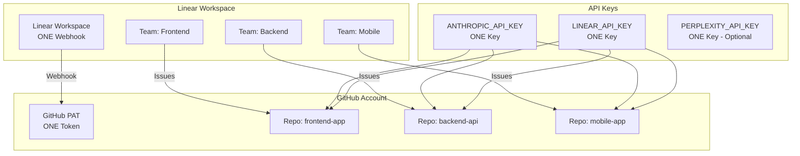

# 🌟 Cloud Workflow Complete Explanation

## Overview: How Everything Connects



## 📚 Complete Setup Guide

### Step 1: One-Time Global Setup (Do This ONCE)

```bash
# Save your API keys globally
cat > ~/.claude-code-template/secrets.env << EOF
export ANTHROPIC_API_KEY="sk-ant-api03-YOUR_KEY"
export LINEAR_API_KEY="lin_api_YOUR_KEY"
export PERPLEXITY_API_KEY="pplx-YOUR_KEY"  # Optional
EOF
```

### Step 2: Per-Repository Setup (For Each New Project)

```bash
# Create new project from template
gh repo create my-new-project --template=yourusername/claude-code-template
cd my-new-project

# Run the unified setup command
./setup-cloud-workflow.sh
```

This single command:
1. Creates GitHub repository (if needed)
2. Sets all GitHub secrets from saved keys
3. Installs Claude Code GitHub App
4. Initializes TaskMaster
5. Sets up workflows
6. Provides Linear webhook instructions

### Step 3: Linear Webhook Setup (ONE TIME for entire workspace)

## 🔑 Key Concepts Explained

### **1. Webhook Architecture**

**YOU NEED**: 
- **ONE webhook** per Linear workspace (not per team, not per repo)
- **ONE GitHub PAT** with repo scope
- **ONE Linear API key** for all repos
- **ONE Anthropic API key** for all repos

**HOW IT ROUTES**:
```yaml
Linear Team "frontend" → Webhook → GitHub → frontend-app repo
Linear Team "backend"  → Webhook → GitHub → backend-api repo
Linear Team "mobile"   → Webhook → GitHub → mobile-app repo
```

### **2. The Routing Problem & Solution**

**Current Limitation**: 
- Linear webhook can only point to ONE URL
- But you have MULTIPLE repositories

**Solutions**:

#### Option A: Primary Dispatcher (Recommended)
```bash
# One main repo receives ALL webhooks
claude-code-dispatcher/
  └── .github/workflows/
      └── linear-router.yml  # Routes to other repos based on team
```

#### Option B: Team-Specific Webhooks
```bash
# Create separate webhooks for each team
Webhook 1: Team Frontend → frontend-app/dispatches
Webhook 2: Team Backend → backend-api/dispatches
Webhook 3: Team Mobile → mobile-app/dispatches
```

#### Option C: Webhook Proxy Service (Advanced)
```bash
# Use a service like Pipedream or Zapier
Linear → Pipedream → Route based on team → Correct GitHub repo
```

### **3. API Keys Explained**

| Key | Where Used | Why Needed | Scope |
|-----|------------|------------|-------|
| **ANTHROPIC_API_KEY** | GitHub Actions | Claude Code Action requires it | One key for all repos |
| **LINEAR_API_KEY** | GitHub Actions | Update Linear issues from CI/CD | One key for all repos |
| **GITHUB_PAT** | Linear Webhook | Trigger repository_dispatch | One token for all repos |
| **PERPLEXITY_API_KEY** | TaskMaster | Research capabilities (optional) | One key for all repos |

### **4. The Complete Flow**

1. **Developer creates Linear issue**:
   ```
   Title: Add user authentication
   Description: @claude implement JWT auth with refresh tokens
   Team: backend
   ```

2. **Linear webhook fires**:
   ```json
   POST https://api.github.com/repos/yourname/backend-api/dispatches
   {
     "event_type": "linear-webhook",
     "client_payload": {
       "team": "backend",
       "title": "Add user authentication",
       "description": "@claude implement JWT auth..."
     }
   }
   ```

3. **GitHub Actions triggers**:
   - Receives webhook
   - Checks team matches repo
   - Runs Claude Code Action
   - Uses TaskMaster to generate PRD
   - Creates subtasks in Linear
   - Implements code
   - Opens PR

4. **Linear gets updated**:
   - Original issue updated with PRD
   - Subtasks created
   - Status synced
   - PR linked

## 🚀 Quick Start Commands

### For Brand New Project
```bash
# One command to rule them all
npx create-claude-template my-project
cd my-project
./setup-cloud-workflow.sh
```

### For Existing Project
```bash
# Add cloud workflow to existing repo
curl -L https://github.com/yourusername/claude-code-template/archive/main.tar.gz | tar xz
cp -r claude-code-template-main/.github .
cp claude-code-template-main/setup-cloud-workflow.sh .
./setup-cloud-workflow.sh
```

## 🤔 FAQs

### Q: Do I need a webhook per team?
**A: No!** One webhook for your entire Linear workspace. The workflow routes based on team.

### Q: Do I need different API keys per repo?
**A: No!** Use the same keys across all repos. Store them once, reuse everywhere.

### Q: What if I have 50 repos?
**A: Two options:**
1. Use a dispatcher repo that routes to all 50
2. Create team-based webhooks (e.g., one for frontend team → all frontend repos)

### Q: Can I use this without Linear?
**A: Yes!** The GitHub @claude mention workflow still works independently.

### Q: What about security?
**A: All secrets are:**
- Stored encrypted in GitHub
- Never exposed in logs
- Scoped to minimum permissions
- Rotatable anytime

## 🏗️ Architecture Decisions

### Why ONE Webhook?
- Simpler Linear configuration
- Easier to manage
- Single point of control
- Can route intelligently

### Why Not MCP in GitHub Actions?
- MCP requires interactive OAuth
- GitHub Actions runs headless
- API keys work in CI/CD
- Same functionality, different auth

### Why TaskMaster?
- Breaks complex tasks into subtasks
- Creates dependencies
- Syncs with Linear
- Works with Claude Code backend

## 📊 Comparison: Local vs Cloud

| Feature | Local Development | Cloud Workflow |
|---------|------------------|----------------|
| **Linear MCP** | OAuth (no key) | API key required |
| **Claude Code** | CLI auth works | API key required |
| **TaskMaster** | Can use Claude Code | Needs Anthropic API |
| **Trigger** | Manual in terminal | Automatic from Linear |
| **Location** | Your machine | GitHub Actions |
| **Team Access** | Just you | Anyone with Linear |

## 🎯 The Ultimate Setup

### Ideal Configuration:
1. **One dispatcher repository** that receives all webhooks
2. **Team-based routing** in the dispatcher
3. **Shared secrets** across all repos
4. **Linear teams** matching repo naming convention

### Example Structure:
```
your-org/
├── claude-dispatcher/        # Receives all webhooks
├── frontend-web/            # Team: frontend-web
├── frontend-mobile/         # Team: frontend-mobile
├── backend-api/            # Team: backend-api
├── backend-workers/        # Team: backend-workers
└── infrastructure/         # Team: devops
```

## 🔧 Troubleshooting

### Webhook not triggering?
- Check Linear webhook logs
- Verify GitHub PAT has `repo` scope
- Ensure webhook URL is correct
- Check team mapping matches

### Claude not running?
- Verify ANTHROPIC_API_KEY is set
- Check GitHub Actions logs
- Ensure @claude is mentioned
- Verify Claude Code App is installed

### TaskMaster not working?
- Check initialization ran
- Verify models are configured
- Ensure Linear API key is set
- Check TaskMaster version (needs v0.25.1+)

## 🚦 Next Steps

1. **Run setup**: `./setup-cloud-workflow.sh`
2. **Configure Linear webhook** (once for workspace)
3. **Create test issue** in Linear with @claude
4. **Watch the magic** as it implements automatically

---

**Remember**: You set this up ONCE per workspace, not per repo. One webhook routes to all your repos based on team!