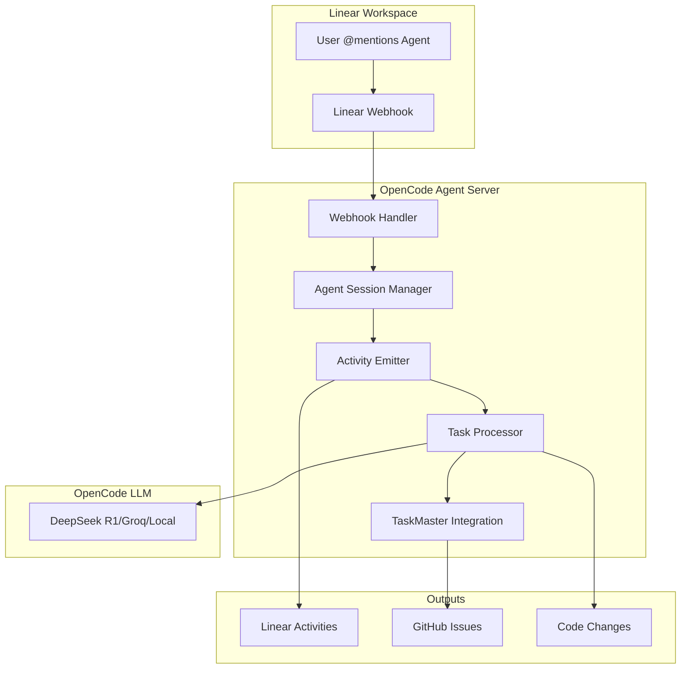

# Linear Agent for OpenCode - Implementation Plan

## Executive Summary

Building a Linear agent for OpenCode that provides AI-powered automation for Linear workspaces while using cost-effective models like DeepSeek R1 ($0.14/1M tokens) instead of Claude ($3-15/1M tokens). This agent will integrate with Linear's native agent system and work seamlessly with TaskMaster for task management.

## Architecture Overview

### Core Components



## Implementation Requirements

### 1. Linear OAuth Application Setup

```typescript
// Configuration for Linear OAuth App
const LINEAR_APP_CONFIG = {
  name: "OpenCode AI Assistant",
  icon: "🤖", // Or custom icon URL
  webhookUrl: "https://your-server.com/webhooks/linear",
  scopes: [
    "read",
    "write",
    "app:mentionable",    // Allow @mentions
    "app:assignable",     // Allow delegation
    "customer:read",      // Optional: Customer access
    "initiative:read"     // Optional: Initiative access
  ],
  webhookEvents: [
    "AgentSessionEvent",  // Core agent events
    "InboxNotifications", // Issue updates
    "PermissionChanges"   // Access changes
  ]
}
```

### 2. Agent Server Implementation

```typescript
// server.ts - Main webhook handler
import express from 'express';
import { LinearClient } from '@linear/sdk';
import { OpenCodeClient } from './opencode-client';
import { TaskMasterClient } from './taskmaster-client';

const app = express();
const linear = new LinearClient({ apiKey: process.env.LINEAR_API_KEY });
const opencode = new OpenCodeClient({
  model: 'deepseek/deepseek-r1-distill-llama-3.2-8b',
  apiKey: process.env.DEEPSEEK_API_KEY
});

// Webhook handler for Linear events
app.post('/webhooks/linear', async (req, res) => {
  const { action, type, data } = req.body;
  
  // Acknowledge webhook within 5 seconds
  res.status(200).send({ received: true });
  
  if (type === 'AgentSessionEvent') {
    await handleAgentSession(action, data);
  }
});

async function handleAgentSession(action: string, data: any) {
  const { agentSession } = data;
  
  if (action === 'created') {
    // New session - respond within 10 seconds
    await emitThought(agentSession.id, "Analyzing your request...");
    
    // Process the request
    const context = extractContext(agentSession);
    const response = await processWithOpenCode(context);
    
    // Emit activities based on response
    await emitActivities(agentSession.id, response);
    
  } else if (action === 'prompted') {
    // User follow-up
    const { agentActivity } = data;
    await handleFollowUp(agentSession.id, agentActivity);
  }
}
```

### 3. Agent Activity System

```typescript
// activities.ts - Activity emission system
export class ActivityEmitter {
  constructor(private linear: LinearClient) {}
  
  // Emit a thought (processing indicator)
  async emitThought(sessionId: string, message: string, ephemeral = false) {
    return this.linear.createAgentActivity({
      agentSessionId: sessionId,
      content: {
        type: 'thought',
        body: message
      },
      ephemeral
    });
  }
  
  // Emit an action (tool call)
  async emitAction(sessionId: string, tool: string, args: any, ephemeral = false) {
    return this.linear.createAgentActivity({
      agentSessionId: sessionId,
      content: {
        type: 'action',
        tool,
        arguments: args
      },
      ephemeral
    });
  }
  
  // Request user input
  async emitElicitation(sessionId: string, prompt: string, options?: string[]) {
    return this.linear.createAgentActivity({
      agentSessionId: sessionId,
      content: {
        type: 'elicitation',
        prompt,
        options
      }
    });
  }
  
  // Final response
  async emitResponse(sessionId: string, body: string, actions?: any[]) {
    return this.linear.createAgentActivity({
      agentSessionId: sessionId,
      content: {
        type: 'response',
        body,
        actions
      }
    });
  }
  
  // Error handling
  async emitError(sessionId: string, message: string, retry = false) {
    return this.linear.createAgentActivity({
      agentSessionId: sessionId,
      content: {
        type: 'error',
        body: message,
        retry
      }
    });
  }
}
```

### 4. OpenCode Integration

```typescript
// opencode-client.ts - OpenCode LLM integration
export class OpenCodeClient {
  constructor(private config: OpenCodeConfig) {}
  
  async processRequest(context: AgentContext): Promise<AgentResponse> {
    // Extract request details
    const { issue, comment, previousComments, guidance } = context;
    
    // Build prompt with Linear context
    const prompt = this.buildPrompt({
      issue,
      comment,
      history: previousComments,
      guidance: guidance || "Follow Linear best practices"
    });
    
    // Call OpenCode model (DeepSeek/Groq/Local)
    const response = await this.callModel(prompt);
    
    // Parse response into activities
    return this.parseResponse(response);
  }
  
  private async callModel(prompt: string) {
    // Use DeepSeek for complex reasoning
    if (this.config.model.includes('deepseek')) {
      return await this.callDeepSeek(prompt);
    }
    // Use Groq for fast responses
    if (this.config.model.includes('groq')) {
      return await this.callGroq(prompt);
    }
    // Use local Ollama for privacy
    if (this.config.model === 'local') {
      return await this.callOllama(prompt);
    }
  }
}
```

### 5. TaskMaster Integration

```typescript
// taskmaster-integration.ts
export class TaskMasterLinearBridge {
  constructor(
    private taskmaster: TaskMasterClient,
    private linear: LinearClient
  ) {}
  
  async handleComplexTask(sessionId: string, issue: LinearIssue) {
    // Generate PRD from Linear issue
    const prd = await this.generatePRD(issue);
    
    // Create TaskMaster project
    const project = await this.taskmaster.initializeProject({
      prd,
      models: {
        main: 'deepseek/deepseek-r1-distill-llama-3.2-8b',
        research: 'perplexity/sonar-pro'
      }
    });
    
    // Parse PRD into tasks
    const tasks = await this.taskmaster.parsePRD(project.id);
    
    // Create Linear sub-issues for each task
    for (const task of tasks) {
      const subIssue = await this.linear.createIssue({
        title: `[OpenCode] ${task.title}`,
        description: this.formatTaskDescription(task),
        parentId: issue.id,
        teamId: issue.teamId,
        labels: ['opencode-task'],
        customFields: {
          taskmaster_id: task.id
        }
      });
      
      // Store mapping
      await this.storeMapping(task.id, subIssue.id);
    }
    
    return { project, tasks };
  }
  
  async executeNextTask(sessionId: string) {
    const nextTask = await this.taskmaster.getNextTask();
    
    if (!nextTask) {
      return { done: true };
    }
    
    // Update Linear sub-issue
    const linearId = await this.getLinearId(nextTask.id);
    await this.linear.updateIssue(linearId, {
      state: 'in_progress'
    });
    
    // Execute task
    const result = await this.taskmaster.executeTask(nextTask.id);
    
    // Update Linear with results
    await this.linear.updateIssue(linearId, {
      state: result.success ? 'done' : 'cancelled',
      comment: result.details
    });
    
    return result;
  }
}
```

### 6. OpenCode Workflow Configuration

```yaml
# .github/workflows/opencode-linear.yml
name: OpenCode Linear Agent

on:
  webhook:
    types: [linear_agent_session]
  workflow_dispatch:
    inputs:
      linear_issue_id:
        description: 'Linear Issue ID'
        required: true

jobs:
  process-linear-request:
    runs-on: ubuntu-latest
    steps:
      - name: Checkout repository
        uses: actions/checkout@v4
        
      - name: Setup Node.js
        uses: actions/setup-node@v4
        with:
          node-version: '20'
          
      - name: Install dependencies
        run: |
          npm install -g task-master-ai@latest
          npm install @linear/sdk
          
      - name: Run OpenCode Linear Agent
        uses: sst/opencode/github@latest
        env:
          LINEAR_API_KEY: ${{ secrets.LINEAR_API_KEY }}
          DEEPSEEK_API_KEY: ${{ secrets.DEEPSEEK_API_KEY }}
          PERPLEXITY_API_KEY: ${{ secrets.PERPLEXITY_API_KEY }}
          GITHUB_TOKEN: ${{ secrets.GITHUB_TOKEN }}
        with:
          model: deepseek/deepseek-r1-distill-llama-3.2-8b
          prompt: |
            Process Linear agent session:
            - Session ID: ${{ github.event.client_payload.session_id }}
            - Issue: ${{ github.event.client_payload.issue }}
            - Request: ${{ github.event.client_payload.request }}
```

## Deployment Architecture

### Option 1: Cloudflare Workers (Recommended)

```typescript
// wrangler.toml
name = "opencode-linear-agent"
main = "src/worker.ts"
compatibility_date = "2024-01-15"

[env.production]
LINEAR_API_KEY = "@LINEAR_API_KEY"
DEEPSEEK_API_KEY = "@DEEPSEEK_API_KEY"

// src/worker.ts
export default {
  async fetch(request: Request, env: Env): Promise<Response> {
    if (request.method === 'POST' && request.url.includes('/webhook')) {
      const payload = await request.json();
      
      // Process webhook asynchronously
      env.QUEUE.send(payload);
      
      // Return immediately
      return new Response(JSON.stringify({ received: true }), {
        status: 200
      });
    }
    
    return new Response('Not Found', { status: 404 });
  }
};
```

### Option 2: Vercel Edge Functions

```typescript
// api/webhook.ts
import { NextRequest, NextResponse } from 'next/server';

export const runtime = 'edge';

export async function POST(req: NextRequest) {
  const payload = await req.json();
  
  // Queue processing
  await queueAgentSession(payload);
  
  return NextResponse.json({ received: true });
}
```

### Option 3: Self-Hosted with Docker

```dockerfile
FROM node:20-alpine
WORKDIR /app
COPY package*.json ./
RUN npm ci --only=production
COPY . .
EXPOSE 3000
CMD ["node", "server.js"]
```

## Cost Analysis

### API Cost Comparison

| Component | Claude Code | OpenCode Agent | Savings |
|-----------|------------|----------------|---------|
| LLM Model | Claude Sonnet ($3-15/1M) | DeepSeek R1 ($0.14/1M) | 95%+ |
| Average Request | ~10K tokens | ~10K tokens | - |
| Cost per Request | $0.03-0.15 | $0.0014 | $0.0286-0.1486 |
| Monthly (1000 requests) | $30-150 | $1.40 | $28.60-148.60 |

### Infrastructure Costs

| Platform | Monthly Cost | Features |
|----------|-------------|----------|
| Cloudflare Workers | $5 (10M requests) | Global edge, auto-scaling |
| Vercel | $20 (Pro) | Edge functions, analytics |
| Self-hosted (VPS) | $5-20 | Full control, custom setup |

## Implementation Timeline

### Week 1: Foundation
- [ ] Create Linear OAuth application
- [ ] Set up webhook server (Cloudflare/Vercel)
- [ ] Implement basic webhook handler
- [ ] Test agent session creation

### Week 2: Core Features
- [ ] Implement activity emitter system
- [ ] Integrate OpenCode LLM calls
- [ ] Add TaskMaster bridge
- [ ] Handle basic Linear operations

### Week 3: Advanced Features
- [ ] Add proactive session creation
- [ ] Implement complex task handling
- [ ] Add GitHub integration
- [ ] Create sync mechanisms

### Week 4: Testing & Deployment
- [ ] Comprehensive testing
- [ ] Performance optimization
- [ ] Documentation
- [ ] Production deployment

## Key Features

### 1. Natural Language Processing
```typescript
// Process various request types
const requestHandlers = {
  'create_task': handleTaskCreation,
  'update_issue': handleIssueUpdate,
  'generate_prd': handlePRDGeneration,
  'code_review': handleCodeReview,
  'bug_fix': handleBugFix
};
```

### 2. Smart Context Understanding
- Parse Linear issue hierarchy
- Understand team/project context
- Respect workspace guidance
- Consider previous comments

### 3. Seamless TaskMaster Integration
- Auto-generate PRDs
- Create task breakdowns
- Track progress in Linear
- Sync status bidirectionally

### 4. GitHub Integration
- Create branches from Linear
- Submit PRs with context
- Link commits to issues
- Update Linear on PR status

## Testing Strategy

### Unit Tests
```typescript
describe('LinearAgent', () => {
  it('should respond to agent session within 10 seconds', async () => {
    const session = createMockSession();
    const response = await agent.handleSession(session);
    expect(response.time).toBeLessThan(10000);
  });
  
  it('should emit thought activity first', async () => {
    const activities = await agent.processRequest(mockRequest);
    expect(activities[0].type).toBe('thought');
  });
});
```

### Integration Tests
- Test Linear API interactions
- Verify OpenCode model calls
- Check TaskMaster integration
- Validate GitHub operations

### End-to-End Tests
- Complete workflow from mention to PR
- Error recovery scenarios
- Rate limiting handling
- Concurrent session management

## Security Considerations

### API Key Management
```typescript
// Use environment variables
const config = {
  linear: {
    apiKey: process.env.LINEAR_API_KEY,
    webhookSecret: process.env.LINEAR_WEBHOOK_SECRET
  },
  opencode: {
    apiKey: process.env.DEEPSEEK_API_KEY
  }
};

// Verify webhook signatures
function verifyWebhook(req: Request): boolean {
  const signature = req.headers['linear-signature'];
  const computed = hmac(req.body, config.linear.webhookSecret);
  return signature === computed;
}
```

### Rate Limiting
```typescript
const rateLimiter = new RateLimiter({
  windowMs: 60 * 1000, // 1 minute
  max: 100 // requests per window
});
```

### Data Privacy
- No storage of sensitive data
- Ephemeral activity marking
- Secure token handling
- Audit logging

## Monitoring & Observability

### Metrics to Track
```typescript
const metrics = {
  sessionCount: new Counter('agent_sessions_total'),
  responseTime: new Histogram('agent_response_time'),
  errorRate: new Counter('agent_errors_total'),
  modelCost: new Counter('model_tokens_used')
};
```

### Logging
```typescript
logger.info('Agent session started', {
  sessionId: session.id,
  issueId: session.issue.id,
  teamId: session.issue.teamId,
  timestamp: Date.now()
});
```

### Alerts
- Session timeout (>10s initial response)
- High error rate (>5%)
- API rate limits approached
- Model API failures

## Troubleshooting Guide

### Common Issues

#### Agent Not Responding
```bash
# Check webhook delivery
curl -X POST https://your-server.com/webhook/test

# Verify Linear webhook secret
echo -n "payload" | openssl dgst -sha256 -hmac "your-secret"

# Check logs
tail -f /var/log/opencode-agent.log
```

#### Session Timing Out
- Ensure initial thought emitted <10s
- Check network latency
- Verify async processing
- Monitor queue depth

#### Model API Errors
- Validate API keys
- Check rate limits
- Verify model availability
- Implement fallback models

## Best Practices

### 1. Fast Initial Response
Always emit a thought within 10 seconds to avoid timeout:
```typescript
async function handleNewSession(session) {
  // Immediately acknowledge
  await emitThought(session.id, "Processing your request...");
  
  // Then process fully
  const result = await processRequest(session);
  await emitResponse(session.id, result);
}
```

### 2. Meaningful Activities
Use appropriate activity types:
- **Thought**: Processing steps
- **Action**: Tool/API calls
- **Elicitation**: Need user input
- **Response**: Final answer
- **Error**: Problems occurred

### 3. Handle Signals
Respect user signals:
```typescript
if (activity.signal === 'stop') {
  await cleanup();
  await emitResponse(sessionId, "Stopped as requested");
  return;
}
```

### 4. Proactive Sessions
Create sessions for automated tasks:
```typescript
const session = await linear.agentSessionCreateOnIssue({
  issueId: issue.id,
  reason: "Automated code review triggered"
});
```

## Migration from Claude Code

### Step 1: Update Workflow Triggers
```yaml
# Before (Claude Code)
if: contains(github.event.comment.body, '@claude')

# After (OpenCode)
if: |
  contains(github.event.comment.body, '@claude') ||
  contains(github.event.comment.body, '/oc') ||
  contains(github.event.comment.body, '/opencode')
```

### Step 2: Replace API Calls
```typescript
// Before
const claude = new Anthropic({ apiKey: CLAUDE_KEY });

// After
const opencode = new OpenCodeClient({
  model: 'deepseek/deepseek-r1-distill-llama-3.2-8b',
  apiKey: DEEPSEEK_KEY
});
```

### Step 3: Update Documentation
- Update README with new commands
- Document cost savings
- Provide migration guide
- Update team training materials

## Conclusion

Building a Linear agent for OpenCode provides:
- **95%+ cost reduction** vs Claude Code
- **Native Linear integration** with agent UI
- **Full TaskMaster support** for complex tasks
- **GitHub automation** for development workflows
- **Flexible deployment** options

The implementation leverages Linear's agent system for natural workspace integration while using cost-effective models through OpenCode, making AI automation accessible for all teams.

## Resources

- [Linear Agent Docs](https://linear.app/developers/agents)
- [OpenCode GitHub](https://github.com/sst/opencode)
- [TaskMaster Docs](https://github.com/khowarizmi/task-master-ai)
- [Example Agent (Weather Bot)](https://github.com/linear/weather-bot)