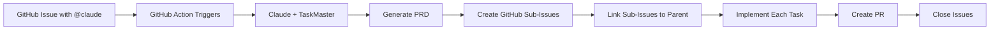

# Claude Code Template (CCT) - GitHub + TaskMaster Integration

A powerful automation framework that enables fully cloud-hosted development workflows. Create projects with one command and manage everything through GitHub Issues - no local machine needed after setup!

## 🎯 Overview

**One Command Setup**: `cct my-project` creates everything you need.

This template creates an automated workflow where:
1. You run `cct my-project` to create and configure a new repository
2. Create issues in GitHub with @claude mentions
3. Claude automatically generates PRDs and breaks them into GitHub sub-issues
4. Tasks execute sequentially with real-time GitHub updates
5. PRs are created and linked back to parent issues

## ⚡ Quick Start

```bash
# Install CCT globally (one-time)
curl -sSL https://github.com/orchidautomation/claude-code-template/raw/main/install.sh | bash

# Create any new project
cct my-awesome-project

# That's it! Your GitHub automation is ready.
```

## 🚀 Features

- **One Command Setup**: `cct my-project` does everything
- **Fully Cloud Hosted**: Work from GitHub on any device - phone, tablet, or computer
- **Automated PRD Generation**: Converts GitHub issues into detailed Product Requirements Documents  
- **Smart Task Breakdown**: Uses TaskMaster to create proper GitHub sub-issues with parent-child relationships
- **Real-time Updates**: Progress tracked via GitHub sub-issues and status updates
- **GitHub Actions Integration**: Automatically triggers on @claude mentions
- **Template-based Setup**: Easily replicate across all your projects
- **Team Collaboration**: Anyone can create issues in GitHub to trigger development

## 📁 Repository Structure

```
claude-code-template/
├── .github/
│   ├── workflows/
│   │   └── claude-code.yml          # GitHub Actions workflow
│   └── ISSUE_TEMPLATE/
│       └── feature_request.md        # Issue template
├── .claude/
│   ├── agents/
│   │   ├── github-taskmaster-sync.md  # GitHub-TaskMaster sync agent
│   │   ├── github-taskmaster-full.md  # Full automation agent
│   │   └── taskmaster-executor.md     # Task execution agent
│   ├── mcp.json                     # MCP server configuration
│   └── CLAUDE.md                    # Claude Code rules
├── .taskmaster/
│   └── docs/
│       └── .gitkeep
├── setup.sh                         # Auto-setup script
└── README.md                        # This file
```

## 🛠️ Installation

### Quick Install (Recommended)

```bash
# One-time global install
curl -sSL https://github.com/orchidautomation/claude-code-template/raw/main/install.sh | bash

# Then create projects with one command
cct my-new-project
```

### Manual Installation

#### Step 1: GitHub Setup

**Add Required Secrets to GitHub:**
```bash
# Required for Claude Code Action in GitHub Actions
gh secret set ANTHROPIC_API_KEY -b "sk-ant-api03-YOUR_KEY_HERE"

# Optional for research capabilities
gh secret set PERPLEXITY_API_KEY -b "pplx-YOUR_KEY_HERE"
```

#### Step 2: Create Your Template Repository

1. Create a new repository on GitHub called `claude-code-template`
2. Copy all files from this directory to your repository
3. Mark it as a template repository in GitHub settings

#### Step 3: Configure MCP Servers

Add the following to your Claude Code MCP configuration:

**For Claude Code** (`.claude/mcp.json`):
```json
{
  "mcpServers": {
    "taskmaster-ai": {
      "command": "npx",
      "args": ["-y", "task-master-ai"],
      "env": {
        "PERPLEXITY_API_KEY": "${PERPLEXITY_API_KEY}"
      }
    },
    "github": {
      "command": "npx",
      "args": ["-y", "@modelcontextprotocol/server-github"],
      "env": {
        "GITHUB_TOKEN": "${GITHUB_TOKEN}"
      }
    }
  }
}
```

**Note**: No Anthropic API key needed - TaskMaster automatically uses Claude Code's backend!

### Step 4: Save Your Secrets Once (One-Time Setup)

```bash
# Save your API keys locally for reuse across all projects
./setup-secrets-once.sh
```

This saves your secrets to `~/.claude-code-template/secrets.env` for automatic reuse.

### Step 5: Use Template for New Projects

```bash
# Quick method (after installing CCT)
cct my-new-project

# Or manual method
gh repo create my-new-project --template=orchidautomation/claude-code-template
cd my-new-project
./setup-cloud-workflow.sh
```

**⚠️ CRITICAL**: The Claude Code GitHub App must be installed per repo. The setup script handles this automatically and reuses your saved secrets!

## 🔄 Workflow Process

### GitHub-Driven Workflow 🌟

1. **One-time setup**: Run `cct my-project` to create repo with automation
2. **Create issue in GitHub** with detailed description
3. **Add @claude mention** in issue body or comment
4. **Automated Processing**:
   - Claude generates PRD with TaskMaster
   - Creates proper GitHub sub-issues (linked to parent)
   - Each sub-issue includes @claude mention for automation
   - Implements each task sequentially
   - Creates atomic commits referencing issues
   - Opens PR when complete
   - Updates issue status in real-time

### Automated Processing Flow


### Benefits of GitHub Workflow
- **Native GitHub Integration** - Everything stays in GitHub
- **Proper Sub-Issues** - True parent-child relationships using GitHub's sub-issues API
- **Team Collaboration** - Anyone can create issues and see progress
- **Mobile Friendly** - Create issues from GitHub mobile app
- **Full Traceability** - Every commit linked to issues
- **Automatic Implementation** - Just describe what you want with @claude

## 🤖 Subagents

### GitHub-TaskMaster Sync
Orchestrates TaskMaster workflow with GitHub Issues:
- Generates PRD and updates issue description
- Creates proper GitHub sub-issues for each task
- Links sub-issues using GitHub's REST API
- Executes tasks with atomic commits
- Tracks progress via issue status

### TaskMaster Executor
Handles sequential task implementation:
- Parses PRD and generates tasks
- Executes tasks in dependency order
- Creates atomic commits per task
- Reports progress clearly

### GitHub-TaskMaster Full
Provides full automation with gh CLI:
- All capabilities of sync agent
- Direct gh CLI access for advanced operations
- Complete issue and PR management

## 🔧 Configuration

### Claude Code Rules (CLAUDE.md)
The main configuration file that defines:
- Available subagents
- MCP server settings
- Workflow triggers
- Execution rules
- Rule profiles (cursor, claude, cline, roo, etc.)

### GitHub Actions
Automatically configured to:
- Trigger on @claude mentions
- Use Claude Code Action v1
- Pass environment variables
- Execute workflows

### TaskMaster Settings (v0.18+ with Claude Code Support!)
Configure models in chat:
```
# With Claude Code (no API key needed)
Change the main model to sonnet --claude-code
Change the research model to perplexity/llama-3.1-sonar-large-128k-online

# Or via CLI
task-master models --set-main sonnet --claude-code
task-master models --set-research perplexity/llama-3.1-sonar-large-128k-online
```

Supported AI Providers:
- **Claude Code** (no API key needed): `claude-code/opus`, `claude-code/sonnet`
- **Anthropic**: Claude 3.5 Sonnet, Claude 3 Opus
- **OpenAI**: GPT-4o, GPT-4 Turbo
- **Perplexity** (great for research): Sonar models with real-time web access
- **Google**: Gemini Pro models
- **xAI**: Grok models
- **OpenRouter**: Access to 100+ models

## 📝 Usage Examples

### Creating a Feature
1. Create GitHub issue: "Add user authentication with JWT"
2. Add description with @claude mention
3. Watch as:
   - PRD is generated and added to issue
   - GitHub sub-issues are created (properly linked)
   - Each sub-issue triggers automation
   - Implementation begins
   - PR is opened with issue references

### Monitoring Progress
- Check parent issue for sub-issues summary
- View individual sub-issues for task details
- Review commits linked to issues
- Track PR status and CI/CD results

## 🔄 Maintaining Central Configuration

To update all projects when you change the template:

```bash
# In your project
git remote add template https://github.com/orchidautomation/claude-code-template
git fetch template
git merge template/main --allow-unrelated-histories
```

## 🚦 Environment Variables

Required secrets in GitHub Actions:
- `ANTHROPIC_API_KEY` - **REQUIRED** for Claude Code Action to work
- `GITHUB_TOKEN` - **AUTOMATIC** (provided by GitHub Actions)
- `PERPLEXITY_API_KEY` - **OPTIONAL** for research capabilities

**Important Notes**:
- **Local Development**: Can use Claude Code (no API key) via TaskMaster v0.18+
- **GitHub Actions**: REQUIRES Anthropic API key (Claude Code CLI auth doesn't work in CI/CD)
- **Sub-Issues**: Uses GitHub's native sub-issues API for proper parent-child relationships

## 🎯 Best Practices

1. **PRD Quality**: The more detailed your Linear issue, the better the generated tasks
2. **Task Granularity**: Keep tasks small and focused
3. **Dependencies**: Define clear dependencies in your PRD
4. **Commit Messages**: Let the system handle atomic commits
5. **Review**: Always review generated PRs before merging

## 🔍 Troubleshooting

### TaskMaster Not Using Claude Code
- Verify TaskMaster v0.18+ is installed
- Run `task-master models` to check configuration
- Use `task-master models --set-main sonnet --claude-code`

### Sub-Issues Not Appearing
- Verify @claude mention in sub-issue body
- Check GitHub Actions logs
- Ensure ANTHROPIC_API_KEY is set
- Sub-issues use actual issue ID (not number) for linking

### GitHub Action Not Triggering
- Check workflow file is in `.github/workflows/`
- Verify @claude mention format
- Check GitHub Actions is enabled

## 📚 Resources

- [TaskMaster Documentation](https://docs.task-master.dev/)
- [GitHub REST API Documentation](https://docs.github.com/en/rest)
- [GitHub Sub-Issues Documentation](https://docs.github.com/en/rest/issues/sub-issues)
- [Claude Code Documentation](https://docs.anthropic.com/claude-code)
- [MCP Protocol Specification](https://modelcontextprotocol.io/)

## 🤝 Contributing

Feel free to submit issues and enhancement requests!

## 📄 License

MIT License - feel free to use this template for your projects

---

Created with ❤️ for automated GitHub development workflows