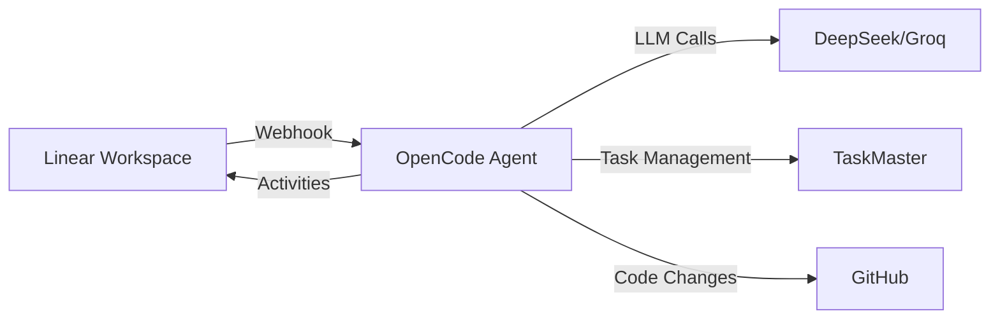

# Linear OpenCode Agent

A cost-effective Linear agent powered by OpenCode (DeepSeek/Groq) that provides AI automation for Linear workspaces at 95% lower cost than traditional solutions.

## Features

- 🤖 **Native Linear Agent Integration** - Appears as a mentionable/assignable user in Linear
- 💰 **95% Cost Reduction** - Uses DeepSeek R1 ($0.14/1M tokens) vs Claude ($3-15/1M)
- 🚀 **Fast Response Times** - <10s initial response requirement met
- 📋 **TaskMaster Integration** - Complex project breakdown and management
- 🔄 **GitHub Integration** - Automatic PR creation and issue linking
- 🌍 **Edge Deployment** - Runs on Cloudflare Workers globally
- 📊 **Full Observability** - Metrics, logging, and monitoring built-in

## Architecture



## Quick Start

### 1. Prerequisites

- Linear workspace with admin access
- Cloudflare account (for deployment)
- API keys for DeepSeek or Groq
- Node.js 18+ for local development

### 2. Installation

```bash
# Clone the repository
git clone https://github.com/your-org/linear-opencode-agent
cd linear-opencode-agent

# Install dependencies
npm install

# Copy environment template
cp .env.example .env
```

### 3. Linear OAuth App Setup

1. Go to [Linear Settings → API → Applications](https://linear.app/settings/api/applications/new)
2. Create a new application with:
   - **Name**: OpenCode Agent (or your preferred name)
   - **Icon**: 🤖 or upload custom icon
   - **Redirect URI**: `https://your-worker.workers.dev/oauth/callback`
   - **Webhook URL**: `https://your-worker.workers.dev/webhook`

3. Enable webhooks and subscribe to:
   - ✅ Agent session events (required)
   - ✅ Permission changes (recommended)
   - ✅ Inbox notifications (optional)

4. Add OAuth scopes in the authorization URL:
   - `read,write` - Basic operations
   - `app:mentionable` - Allow @mentions
   - `app:assignable` - Allow delegation

### 4. Environment Configuration

Edit `.env` with your credentials:

```bash
# Linear Configuration
LINEAR_CLIENT_ID=your_client_id
LINEAR_CLIENT_SECRET=your_client_secret
LINEAR_WEBHOOK_SECRET=your_webhook_secret
LINEAR_API_KEY=your_api_key  # Optional, for direct API access

# Model Configuration (choose one)
DEEPSEEK_API_KEY=your_deepseek_key      # Recommended: $0.14/1M tokens
# GROQ_API_KEY=your_groq_key            # Alternative: ~$0.10/1M tokens
# OPENAI_API_KEY=your_openai_key        # Premium: $0.15/1M tokens

# Optional Services
PERPLEXITY_API_KEY=your_perplexity_key  # For research tasks
TASKMASTER_API_KEY=your_taskmaster_key  # For complex projects

# Deployment
WORKER_URL=https://your-worker.workers.dev
NODE_ENV=production
```

### 5. Deploy to Cloudflare Workers

```bash
# Login to Cloudflare
wrangler login

# Create KV namespace for token storage
wrangler kv:namespace create "LINEAR_TOKENS"

# Update wrangler.toml with the KV namespace ID
# Then set secrets
wrangler secret put LINEAR_CLIENT_SECRET
wrangler secret put LINEAR_WEBHOOK_SECRET
wrangler secret put DEEPSEEK_API_KEY

# Deploy
npm run deploy
```

### 6. Install Agent in Linear

1. Visit `https://your-worker.workers.dev/oauth/authorize`
2. Authorize the app in your Linear workspace
3. The agent is now ready to use!

## Usage

### Mentioning the Agent

In any Linear issue or comment:

```
@OpenCode Can you help implement user authentication?
```

### Delegating Issues

Assign an issue to the OpenCode agent, and it will:
1. Analyze the requirements
2. Break down into tasks (if complex)
3. Execute implementation
4. Report progress back

### Available Commands

The agent understands various request types:

- **Task Creation**: "Create a task for [description]"
- **Complex Projects**: "Implement [feature]" (uses TaskMaster)
- **Code Review**: "Review this PR [link]"
- **Bug Fixes**: "Fix the bug where [description]"
- **Questions**: "How do I [question]?"
- **Status Updates**: "What's the status of [issue]?"

## Development

### Local Development

```bash
# Start local development server
npm run dev

# Run tests
npm test

# Lint code
npm run lint

# Type check
npm run typecheck
```

### Project Structure

```
linear-opencode-agent/
├── src/
│   ├── server.ts           # Express server (for traditional hosting)
│   ├── worker.ts           # Cloudflare Worker entry point
│   ├── activities.ts       # Linear activity emitter
│   ├── session-manager.ts  # Agent session handling
│   ├── opencode-client.ts  # LLM integration (DeepSeek/Groq)
│   ├── taskmaster-bridge.ts # TaskMaster integration
│   └── utils/
│       ├── logger.ts       # Logging utilities
│       ├── metrics.ts      # Prometheus metrics
│       └── security.ts     # Security helpers
├── wrangler.toml          # Cloudflare configuration
├── package.json
└── README.md
```

### Testing

```bash
# Unit tests
npm test

# Integration tests
npm run test:integration

# E2E tests with Linear sandbox
npm run test:e2e
```

## Agent Activity Types

Following Linear's guidelines, the agent emits these activity types:

### Thought
Processing steps and observations:
```typescript
await emitThought(sessionId, "🤔 Analyzing your request...");
```

### Action
Tool/API calls:
```typescript
await emitAction(sessionId, "create_task", { title: "New feature" });
```

### Elicitation
Request user input:
```typescript
await emitElicitation(sessionId, "Which repository should I use?", ["repo1", "repo2"]);
```

### Response
Final answers:
```typescript
await emitResponse(sessionId, "✅ Task completed successfully!");
```

### Error
Problem reports:
```typescript
await emitError(sessionId, "Unable to access repository", true); // retry = true
```

## Cost Analysis

| Scenario | Claude Code | OpenCode Agent | Savings |
|----------|------------|----------------|---------|
| Simple task (5K tokens) | $0.015-0.075 | $0.0007 | 95-99% |
| Complex project (50K tokens) | $0.15-0.75 | $0.007 | 95-99% |
| Monthly (1000 tasks) | $150-750 | $7 | $143-743 |
| Annual projection | $1,800-9,000 | $84 | $1,716-8,916 |

## Performance Metrics

The agent tracks these metrics (exposed at `/metrics`):

- `linear_webhooks_received_total` - Webhook count by type
- `linear_agent_sessions_total` - Session count
- `linear_agent_session_duration_seconds` - Processing time
- `opencode_model_calls_total` - LLM API calls
- `opencode_model_tokens_total` - Token usage
- `taskmaster_tasks_completed_total` - Task completion rate

## Monitoring

### Health Check

```bash
curl https://your-worker.workers.dev/health
```

### Session Status

```bash
curl https://your-worker.workers.dev/session/{sessionId}
```

### Metrics Endpoint

```bash
curl https://your-worker.workers.dev/metrics
```

## Troubleshooting

### Agent Not Responding

1. Check webhook delivery in Linear settings
2. Verify Cloudflare Worker logs: `wrangler tail`
3. Ensure initial thought is emitted within 10 seconds

### Authentication Issues

1. Verify OAuth token exists: Check KV storage
2. Ensure refresh token logic is working
3. Check Linear API permissions

### Model API Errors

1. Verify API keys are set correctly
2. Check rate limits for your provider
3. Implement fallback to alternative model

## Security

- Webhook signatures verified on all requests
- OAuth tokens stored encrypted in KV
- Automatic token refresh before expiry
- Rate limiting per workspace
- Input sanitization for all user content
- Secrets never logged or exposed

## Contributing

1. Fork the repository
2. Create a feature branch
3. Make your changes
4. Add tests
5. Submit a pull request

## License

MIT License - see LICENSE file for details

## Support

- **Documentation**: [Linear Agents Docs](https://linear.app/developers/agents)
- **Issues**: [GitHub Issues](https://github.com/your-org/linear-opencode-agent/issues)
- **Discord**: [Join our Discord](https://discord.gg/your-discord)

## Acknowledgments

- Linear team for the excellent agent API
- OpenCode/SST team for the cost-effective infrastructure
- DeepSeek for affordable, high-quality models
- Inspiration from Linear's Weather Bot example

---

Built with ❤️ to make AI automation accessible to all teams