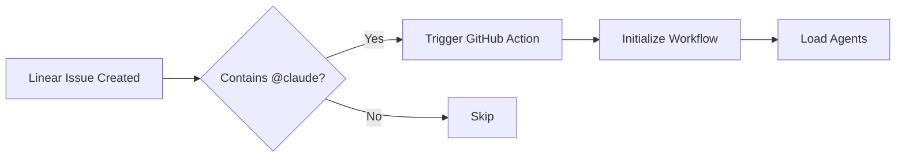

# Linear-TaskMaster Integration Workflow

This workflow orchestrates the complete automation pipeline from Linear issue creation to PR completion.

## Workflow Trigger

**Primary Trigger**: @claude mention in Linear issue
**Secondary Triggers**: 
- Manual workflow dispatch
- Webhook from Linear
- GitHub issue with linear-sync label

## Complete Workflow Process

### Phase 1: Initialization


### Phase 2: PRD Generation

#### Step 1: Parse Linear Issue
- Extract issue ID, title, description
- Identify team and project context
- Collect labels and metadata
- Check for parent issues/epics

#### Step 2: Generate PRD
Call `linear-prd-generator` agent:
```javascript
const prd = await agent.execute('linear-prd-generator', {
  linearIssueId: issue.id,
  title: issue.title,
  description: issue.description,
  context: {
    team: issue.team,
    project: issue.project,
    labels: issue.labels
  }
});
```

#### Step 3: Create Tasks
Use TaskMaster to parse PRD:
```
mcp__taskmaster-ai__initialize_project
mcp__taskmaster-ai__parse_prd
  - input: prd.content
  - numTasks: auto
mcp__taskmaster-ai__expand_all
  - complexity-based expansion
```

### Phase 3: Linear Integration

#### Step 4: Update Linear Issue
```javascript
await linear.updateIssue(issueId, {
  description: `${originalDescription}\n\n## Generated PRD\n${prd.content}`,
  customFields: {
    taskmaster_id: taskmaster.projectId,
    total_tasks: tasks.length
  },
  state: 'in_progress'
});
```

#### Step 5: Create Sub-Issues
For each TaskMaster task:
```javascript
for (const task of tasks) {
  const subIssue = await linear.createIssue({
    title: task.title,
    description: formatTaskDescription(task),
    parentId: parentIssue.id,
    teamId: parentIssue.teamId,
    labels: [...parentIssue.labels, 'auto-generated'],
    customFields: {
      taskmaster_task_id: task.id,
      dependencies: task.dependencies.join(',')
    }
  });
  
  // Store mapping
  mappings[task.id] = subIssue.id;
}
```

### Phase 4: Task Execution

#### Step 6: Sequential Execution
Call `task-executor` agent:
```javascript
while (hasUncompletedTasks()) {
  const nextTask = await taskmaster.nextTask();
  
  if (!nextTask) {
    await handleBlockedTasks();
    continue;
  }
  
  await agent.execute('task-executor', {
    task: nextTask,
    linearSubIssueId: mappings[nextTask.id]
  });
  
  // Sync status
  await agent.execute('linear-sync', {
    source: 'taskmaster',
    taskId: nextTask.id
  });
}
```

#### Step 7: Progress Updates
During execution:
- Update Linear sub-issue status
- Add progress comments
- Update parent issue percentage
- Create commits with proper messages

### Phase 5: PR Creation

#### Step 8: Create Pull Request
When all tasks complete:
```bash
# Create feature branch if not exists
git checkout -b linear/${issueId}-${slugify(issue.title)}

# Ensure all changes committed
git add -A
git commit -m "feat: Complete implementation for ${issue.title}

Linear: ${issue.identifier}
TaskMaster: All tasks completed"

# Push and create PR
git push -u origin HEAD
gh pr create \
  --title "${issue.title}" \
  --body "$(generatePRBody())" \
  --label "linear-sync"
```

#### Step 9: Link PR to Linear
```javascript
await linear.attachPullRequest(issueId, {
  url: pr.url,
  title: pr.title,
  state: pr.state,
  number: pr.number
});
```

### Phase 6: Completion

#### Step 10: Final Updates
- Mark Linear issue as "In Review"
- Update all sub-issues to "Done"
- Add completion comment with PR link
- Generate summary report

## Error Handling

### Retry Logic
```javascript
async function withRetry(fn, maxRetries = 3) {
  for (let i = 0; i < maxRetries; i++) {
    try {
      return await fn();
    } catch (error) {
      if (i === maxRetries - 1) throw error;
      await sleep(Math.pow(2, i) * 1000); // Exponential backoff
    }
  }
}
```

### Failure Recovery
- Store workflow state for resume
- Queue failed operations
- Send notifications on critical failures
- Provide rollback mechanism

## State Management

### Workflow State
```json
{
  "workflowId": "wf-123",
  "linearIssueId": "ISS-456",
  "phase": "task_execution",
  "tasksCompleted": 5,
  "tasksTotal": 10,
  "currentTask": {
    "id": "6",
    "status": "in-progress",
    "startTime": "2024-01-15T10:30:00Z"
  },
  "errors": [],
  "mappings": {
    "1": "ISS-457",
    "2": "ISS-458"
  }
}
```

## Configuration

### Environment Variables
```bash
LINEAR_API_KEY=xxx
GITHUB_TOKEN=xxx
PERPLEXITY_API_KEY=xxx  # Optional for research
```

### Workflow Settings
```yaml
settings:
  maxTasksPerIssue: 20
  taskTimeoutMinutes: 30
  retryAttempts: 3
  syncInterval: 30
  autoMerge: false
```

## Monitoring

### Metrics to Track
- Workflow execution time
- Task completion rate
- Error frequency
- API call count
- Sync latency

### Alerts
- Workflow failure
- Task timeout
- Sync errors
- API rate limits

## Best Practices

1. **Atomic Operations**: Each step should be idempotent
2. **State Persistence**: Save state after each phase
3. **Error Boundaries**: Isolate failures to specific steps
4. **Logging**: Comprehensive logging at each step
5. **Testing**: Validate each phase independently

## Example Execution Log

```
[10:00:00] Workflow started for Linear issue ISS-123
[10:00:01] Loading agents: linear-prd-generator, task-executor, linear-sync
[10:00:02] Parsing Linear issue: "Add user authentication"
[10:00:05] Generating PRD with TaskMaster...
[10:00:45] PRD generated successfully (1500 words)
[10:00:46] Creating 8 tasks with dependencies
[10:00:50] Updating Linear issue with PRD
[10:00:52] Creating 8 Linear sub-issues
[10:01:00] Starting task execution...
[10:01:01] Task 1/8: Setting up auth structure
[10:05:30] Task 1 completed, updating Linear
[10:05:31] Task 2/8: Creating user model
...
[10:45:00] All tasks completed successfully
[10:45:01] Creating pull request
[10:45:05] PR #234 created and linked to Linear
[10:45:06] Workflow completed successfully
```

## Notes

- Workflow runs in Claude Code environment
- No separate API keys for Claude models
- Supports pause/resume capability
- Maintains transaction consistency
- Full audit trail maintained